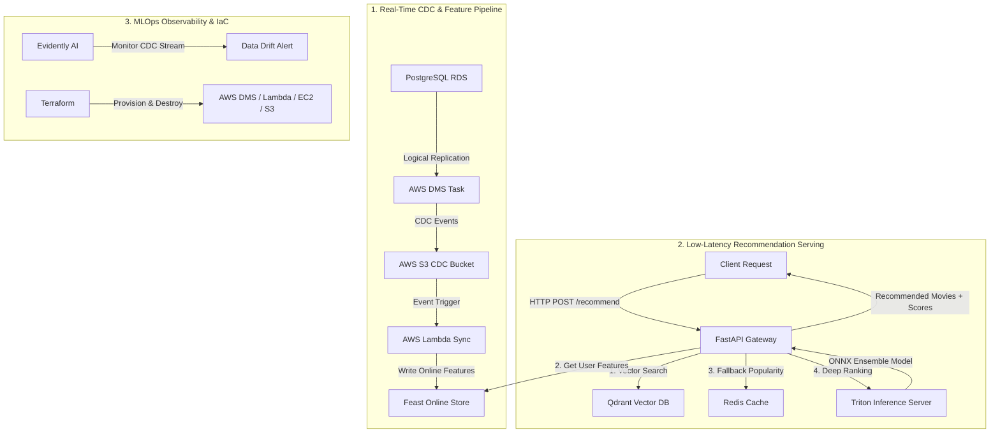

# 🚀 Real-Time MovieLens Recommender System & MLOps Platform

Hệ thống Gợi Ý Phim Thời Gian Thực (Real-Time Movie Recommendation System) thiết kế và triển khai theo chuẩn **Enterprise MLOps Production Grade** trên hạ tầng Cloud (AWS, Kubernetes, Terraform).

---

## 🏗️ 1. KIẾN TRÚC MLOPS TOÀN DIỆN (MLOPS ARCHITECTURE)

Hệ thống được thiết kế theo mô hình **Lambda Architecture** kết hợp luồng xử lý sự kiện thời gian thực (**Real-Time CDC**) và hệ thống phục vụ suy luận độ trễ thấp (**Low-Latency Model Serving**).



### 📋 6 Trụ Cột Cốt Lõi Trong Architecture:

1. **Real-Time CDC Pipeline (Change Data Capture)**:
   * Sử dụng **PostgreSQL Native Logical Replication + AWS DMS (Database Migration Service)** để bắt từng sự kiện chèn/sửa `movie_ratings` theo thời gian thực mà **0% làm giảm hiệu năng của OLTP Database chính**.
   * Đẩy sự kiện qua **AWS S3 ➔ Lambda Function** để liên tục cập nhật Feature mới nhất vào Feature Store.

2. **Feature Store Tập Trung (Feast)**:
   * Quản lý nhất quán tập đặc trưng (Features) giữa 2 môi trường: **Offline** (cho huấn luyện mô hình batch) và **Online Store** (phục vụ lấy feature với độ trễ sub-millisecond khi ranking).

3. **High-Performance Deep Learning Serving (Triton Inference Server)**:
   * Mô hình Xếp hạng (Ranking Model) được đóng gói dưới dạng **ONNX Ensemble Pipeline** (gồm pre-processing, ID mapping, và Deep Sequence Ranking).
   * Triển khai trên **Triton Inference Server**, hỗ trợ **Dynamic Batching** và **Concurrent Execution** giúp tối ưu hóa GPU/CPU gấp 5-10 lần so với Python Web Service thuần.

4. **Vector Search & Candidate Retrieval (Qdrant + Redis Cache)**:
   * **Qdrant Vector DB**: Tìm kiếm ứng viên phim tương tự dựa trên không gian nhúng **Item2Vec Embeddings** với thuật toán HNSW tìm kiếm hàng xóm gần nhất.
   * **Redis Cache**: Cập nhật danh sách phim phổ biến nhất (Popular Items) phục vụ cơ chế **Fallback** giải quyết triệt me sự cố Cold Start (User mới chưa có lịch sử).

5. **Data Drift & Quality Monitoring (Evidently AI)**:
   * Tự động kiểm tra sự suy giảm phân phối dữ liệu (Data Drift / Concept Drift) từ luồng sự kiện CDC thực tế nhằm đưa ra cảnh báo kịp thời cho đội ngũ MLOps tái huấn luyện (Retrain) mô hình.

6. **Infrastructure as Code (Terraform)**:
   * Quản lý 100% tài nguyên hạ tầng AWS (DMS Replication, Endpoints, Lambda, Security Groups, EC2 Serving, S3 Buckets) bằng mã nguồn mã hóa với **Terraform**, hỗ trợ triển khai / dọn dẹp môi trường chỉ với 1 câu lệnh.

---

## 🛠️ 2. CÔNG NGHỆ SỬ DỤNG (TECH STACK)

| Phân Hệ | Công Nghệ / Thư Viện |
| :--- | :--- |
| **Data & Storage** | AWS RDS PostgreSQL, AWS DMS, AWS S3, Redis |
| **Feature Store** | Feast Feature Store |
| **Model Serving** | Triton Inference Server, ONNX Runtime, FastAPI |
| **Vector Database** | Qdrant Vector Database |
| **Data Drift & Monitoring** | Evidently AI, AWS CloudWatch |
| **Infrastructure as Code** | Terraform, Docker, Docker Compose |
| **Environment & Package** | Python 3.11+, UV Package Manager |

---

## 📖 3. HƯỚNG DẪN TRIỂN KHAI (DEPLOYMENT PLAYBOOK)

Toàn bộ quy trình tự tay triển khai chi tiết từng bước từ A-Z trên AWS đã được đóng gói trong tài liệu:
👉 **[Hướng Dẫn Triển Khai Toàn Diện (docs/deployment-guide.md)](docs/deployment-guide.md)**

---

## 🧪 4. VERIFICATION & API TESTING

Gửi yêu cầu tới API Gateway để nhận danh sách gợi ý phim:

```bash
curl -X POST http://localhost:8080/recommend \
     -H "Content-Type: application/json" \
     -d '{"user_id": 1, "current_item_id": 10}'
```

**Kỳ vọng Response (HTTP 200 OK):**
```json
{
  "user_id": 1,
  "recommendations": [
    {"item_id": 318, "score": 0.9421},
    {"item_id": 296, "score": 0.9150},
    {"item_id": 593, "score": 0.8872}
  ]
}
```
