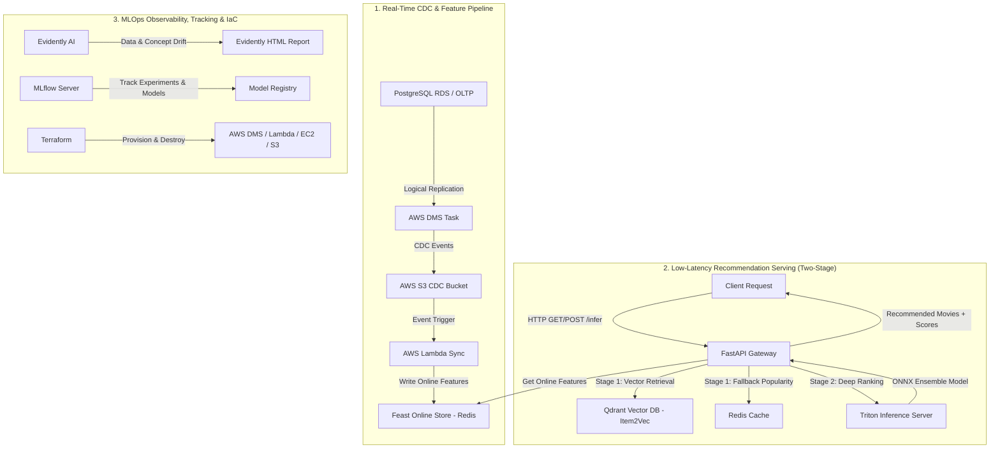

# 🚀 Real-Time MovieLens Recommender System & MLOps Platform

Hệ thống Gợi Ý Phim Thời Gian Thực (Real-Time Movie Recommendation System) thiết kế và triển khai theo chuẩn **Enterprise MLOps Production Grade** trên hạ tầng Cloud (AWS, EC2/EKS, Terraform).

---

## 🗺️ 1. GÓC "MÙ ĐƯỜNG" - DANH SÁCH DASHBOARD & HAY HO ĐỂ CHECK!

Nếu bạn chưa biết bắt đầu từ đâu hoặc muốn mở các trang UI/Dashboard để trải nghiệm hệ thống đang chạy, đây là **bản đồ điều khiển**:

> 💡 *Ghi chú:* Nếu bạn đang chạy trên máy local, dùng `localhost`. Nếu đang triển khai trên EC2 AWS, hãy thay `localhost` bằng `<EC2_PUBLIC_IP>`.

| Tên Dashboard / Service | URL / Link | Tài Khoản (nếu có) | Tính Năng / Thứ Hay Ho Cần Check |
| :--- | :--- | :--- | :--- |
| **🚀 FastAPI Gateway (Swagger UI)** | [`http://localhost:8080/docs`](http://localhost:8080/docs) | *Không cần* | **Giao diện test API trực tiếp!** Bạn có thể gõ `user_id=1` bấm **Execute** để xem danh sách gợi ý phim thời gian thực + điểm số score. |
| **📊 MLflow Experiment Tracking** | [`http://localhost:5000`](http://localhost:5000) | *Không cần* | **Trạm quản lý mô hình AI.** Xem lịch sử train mô hình Item2Vec, so sánh thông số (loss, accuracy, AUC), xem Model Registry champion & tải báo cáo HTML của Evidently AI. |
| **🗄️ MinIO S3 Web Console** | [`http://localhost:9101`](http://localhost:9101) | User: `admin`<br>Pass: `Password1234` | **Giao diện quản lý file S3 Storage.** Kiểm tra bucket `recsys-ops`, xem dữ liệu Parquet, Feature Store data, CDC logs và MLflow model artifacts. |
| **🔍 Qdrant Vector DB Dashboard** | [`http://localhost:6333/dashboard`](http://localhost:6333/dashboard) | *Không cần* | **Trình duyệt Vector Database.** Kiểm tra collection vector nhúng `movie_embeddings` (Item2Vec), cấu hình chỉ mục HNSW và tìm kiếm ứng viên tương tự. |
| **⚡ Feast Feature Store API** | [`http://localhost:8010/docs`](http://localhost:8010/docs) | *Không cần* | **Swagger API của Feature Store.** Kiểm tra cách lấy đặc trưng thời gian thực (real-time features) của User và Item lưu trong Redis. |
| **🔥 Triton Inference Server** | [`http://localhost:8002/metrics`](http://localhost:8002/metrics) | *Không cần* | **Metrics của mô hình AI.** Theo dõi GPU/CPU utilization, latency, throughput và dynamic batching của ONNX ensemble model. |
| **📈 Locust Stress Testing UI** | Chạy `locust -f locustfile.py`<br>➔ Open [`http://localhost:8089`](http://localhost:8089) | *Không cần* | **Mô phỏng hàng ngàn user truy cập đồng thời.** Bấm *Start Swarming* để xem biểu đồ RPS, latency p95/p99 của API Gateway dưới áp lực lớn. |

---

## 🏗️ 2. KIẾN TRÚC MLOPS TOÀN DIỆN (ARCHITECTURAL PILLARS)

Hệ thống được thiết kế theo mô hình **Lambda Architecture** kết hợp luồng xử lý sự kiện thời gian thực (**Real-Time CDC**) và hệ thống phục vụ suy luận độ trễ thấp (**Low-Latency Two-Stage Serving**).



### 📋 6 Trụ Cột Cốt Lõi Trong Architecture:

1. **Real-Time CDC Pipeline (Change Data Capture)**:
   * Sử dụng **PostgreSQL Native Logical Replication + AWS DMS (Database Migration Service)** để bắt từng sự kiện `movie_ratings` theo thời gian thực với **0% ảnh hưởng đến hiệu năng OLTP Database**.
   * Đẩy sự kiện qua **AWS S3 ➔ Lambda Function** để cập nhật Feature mới nhất vào Feature Store.

2. **Feature Store Tập Trung (Feast)**:
   * Quản lý nhất quán tập đặc trưng (Features) giữa 2 môi trường: **Offline** (huấn luyện batch) và **Online Store** (lấy đặc trưng độ trễ sub-millisecond khi ranking).

3. **Two-Stage Recommendation Architecture**:
   * **Stage 1 (Retrieval / Candidate Generation)**: Dùng **Qdrant Vector DB** (Item2Vec HNSW) để lọc ra top ứng viên phù hợp + **Redis Fallback** cho Cold Start.
   * **Stage 2 (Ranking)**: Sử dụng mô hình Deep Learning đóng gói dưới dạng **ONNX Ensemble Pipeline** trên **Triton Inference Server**, hỗ trợ **Dynamic Batching** và **Concurrent Execution**.

4. **Data Drift & Quality Monitoring (Evidently AI)**:
   * Tự động kiểm tra sự suy giảm phân phối dữ liệu (Data Drift / Concept Drift) từ luồng dữ liệu CDC để cảnh báo retrain mô hình.

5. **MLflow Experiment Tracking & Model Registry**:
   * Theo dõi toàn bộ quá trình huấn luyện, hyperparameters, metrics (AUC, Precision/Recall), lưu vết artifact và quản lý phiên bản model champion.

6. **Infrastructure as Code (Terraform)**:
   * Quản lý 100% tài nguyên hạ tầng AWS (DMS Replication, Endpoints, Lambda, Security Groups, EC2 Serving, S3 Buckets) bằng mã nguồn với **Terraform**.

---

## 🛠️ 3. CÔNG NGHỆ SỬ DỤNG (TECH STACK)

| Phân Hệ | Công Nghệ / Thư Viện |
| :--- | :--- |
| **Data & Storage** | AWS RDS PostgreSQL, AWS DMS, AWS S3, Redis |
| **Feature Store** | Feast Feature Store (Redis Online Store) |
| **Vector Database** | Qdrant Vector Database (HNSW Indexing) |
| **Model Serving** | Triton Inference Server (24.08), ONNX Runtime, FastAPI |
| **Model Tracking & Registry** | MLflow, PyTorch |
| **Data Quality & Drift** | Evidently AI |
| **Stress & Load Testing** | Locust Framework |
| **Infrastructure & DevOps** | Terraform, Docker, Docker Compose, AWS Lambda, EC2 |
| **Environment & Package** | Python 3.11+, UV Package Manager |

---

## 🚀 4. HƯỚNG DẪN KHỞI CHẠY & CHECK THỬ

### 🅰️ Chạy Trên Máy Local (Docker Compose)

1. **Khởi động tất cả các service**:
   ```bash
   docker compose up -d
   ```
2. **Kiểm tra trạng thái**:
   ```bash
   docker compose ps
   ```
3. **Mở các Dashboard**:
   * FastAPI Docs: `http://localhost:8080/docs`
   * MLflow UI: `http://localhost:5000`
   * MinIO Console: `http://localhost:9101` (User: `admin`, Pass: `Password1234`)
   * Qdrant Dashboard: `http://localhost:6333/dashboard`

---

### 🅱️ Chạy Kiểm Thử API Từ Terminal

#### **1. Dùng PowerShell (Windows):**
```powershell
# Cách khuyên dùng (tránh lỗi warning Invoke-WebRequest):
curl.exe "http://localhost:8080/infer?user_id=1"

# Hoặc dùng Invoke-RestMethod siêu đẹp:
(Invoke-RestMethod "http://localhost:8080/infer?user_id=1").recommendations
```

#### **2. Dùng Bash / Linux / Mac:**
```bash
curl -X GET "http://localhost:8080/infer?user_id=1"
```

**Kỳ vọng Response (HTTP 200 OK):**
```json
{
  "user_id": 1,
  "recommendations": [
    {"movie_id": 356, "score": 0.94868},
    {"movie_id": 1198, "score": 0.92915},
    {"movie_id": 858, "score": 0.92796},
    {"movie_id": 4993, "score": 0.91129}
  ]
}
```

---

### 🅲 Kiểm Thử Chịu Tải (Load Testing với Locust)

Mô phỏng hàng trăm nghìn request để đo throughput và latency:
```bash
locust -f locustfile.py --host http://localhost:8080
```
Sau đó mở trình duyệt tại `http://localhost:8089`, nhập số lượng user (ví dụ: `100`) và bấm **Start swarming**.

---

## 📚 5. TÀI LIỆU CHI TIẾT DỰ ÁN (DOCUMENTATION)

* 🛠️ **[Báo Cáo A — Minh Chứng Triển Khai Hạ Tầng (docs/deployment-evidence.md)](docs/deployment-evidence.md)**
* 📊 **[Báo Cáo B — Kết Quả & Metrics Đánh Giá (docs/results-report.md)](docs/results-report.md)**
* 📖 **[Hướng Dẫn Triển Khai Toàn Diện AWS (docs/deployment-guide.md)](docs/deployment-guide.md)**
* 🏗️ **[Kiến Trúc CDC & Real-Time Setup (docs/03-realtime-cdc.md)](docs/03-realtime-cdc.md)**
* ☸️ **[Hướng Dẫn Triển Khai EKS Kubernetes Cluster (docs/eks-deploy.md)](docs/eks-deploy.md)**

---

## 📂 6. CẤU TRÚC THƯ MỤC DỰ ÁN (PROJECT STRUCTURE)

```
Recommendation_System/
├── api_gateway/            # FastAPI Gateway (Stage 1 + Stage 2 coordinator)
├── configs/                # Cấu hình dự án (FastAPI, MLflow, Feast)
├── data_pipeline/          # Xử lý dữ liệu CDC, S3 event triggers, Lambda
├── docs/                   # Toàn bộ tài liệu kỹ thuật & deployment guides
├── feature/                # Feast Feature Store definitions & API
├── infra/                  # Terraform IaC (EC2, EKS, DMS, Lambda, S3) & K8s helm
├── models/                 # Model training (Item2Vec, Deep Ranking), ONNX conversion
├── notebooks/              # Jupyter Notebooks EDA & thử nghiệm dữ liệu
├── src/                    # Utility scripts (Qdrant loader, data prep, OLTP checks)
├── docker-compose.yml      # Cấu hình container local dev stack
├── locustfile.py           # Script test chịu tải bằng Locust
└── README.md               # File này
```
