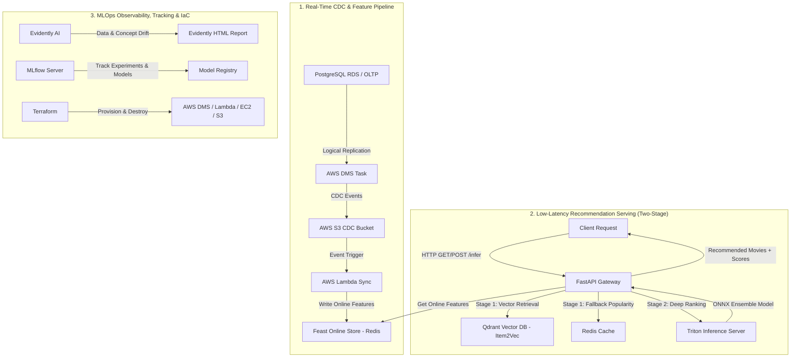
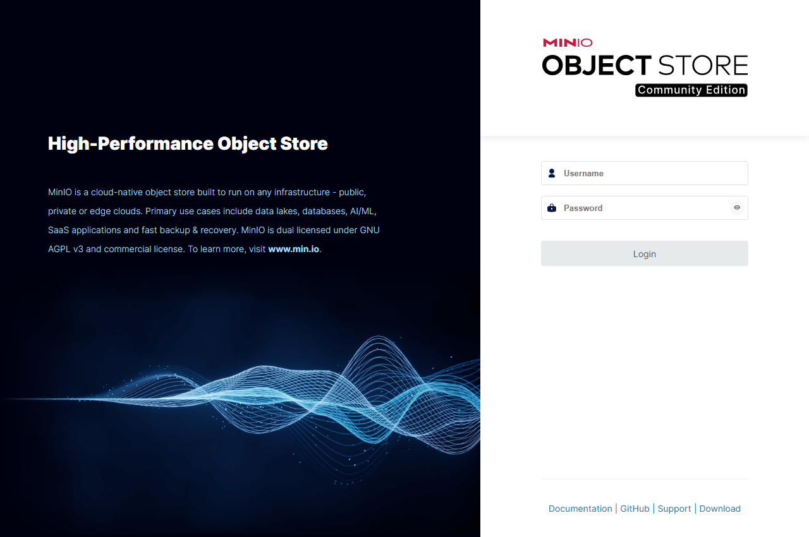
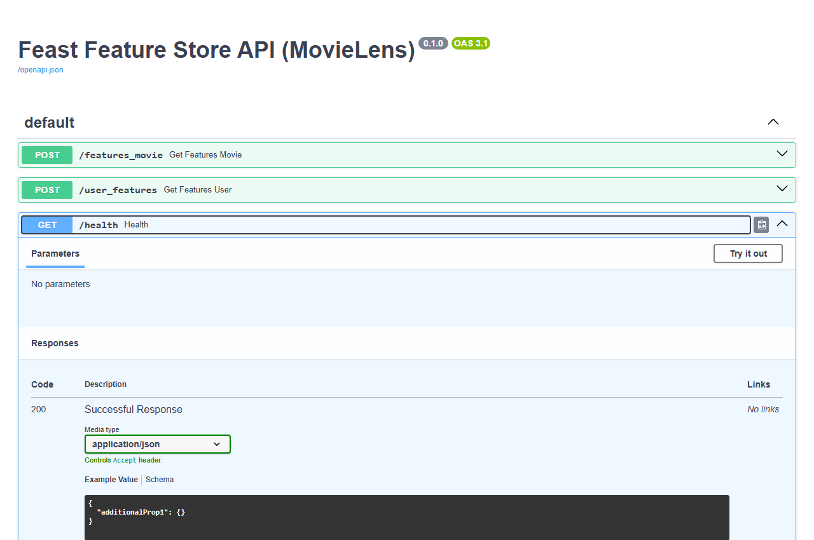
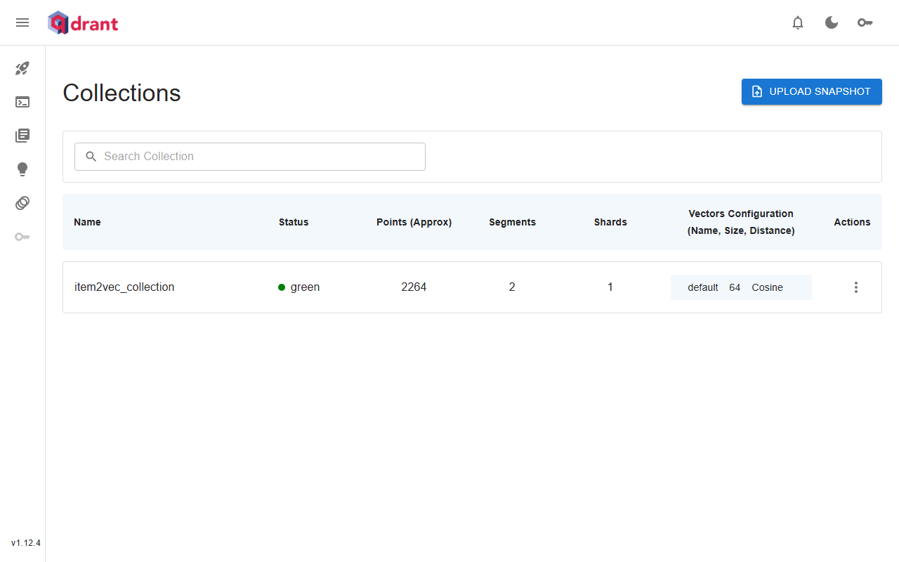
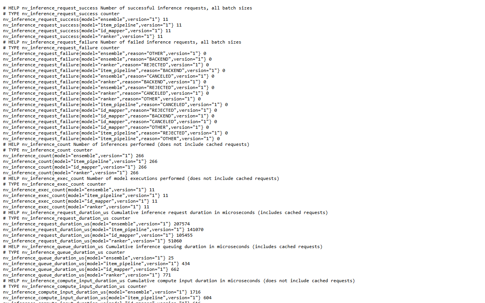
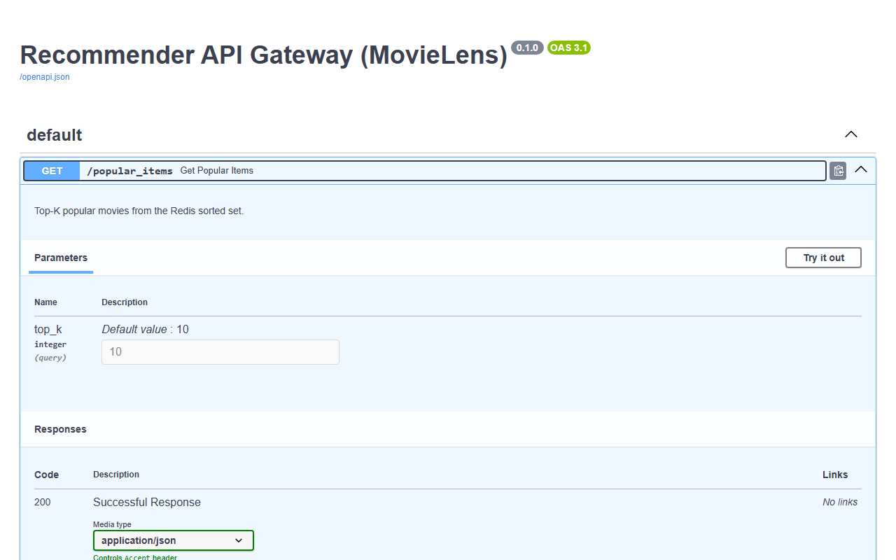
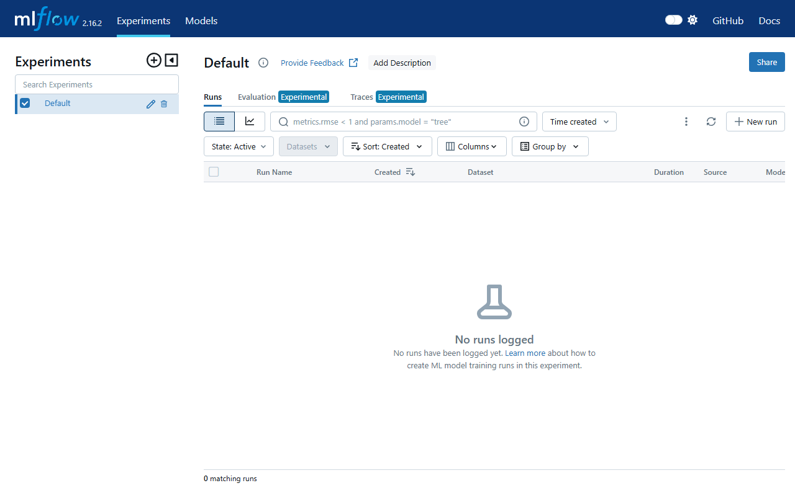
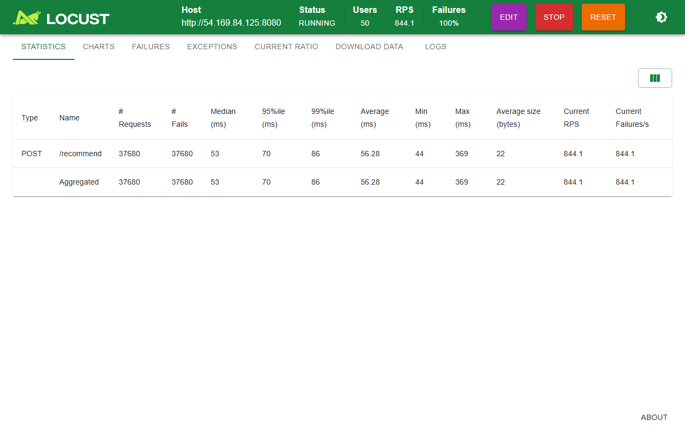

# 🚀 Real-Time MovieLens Recommender System & MLOps Platform

Hệ thống Gợi Ý Phim Thời Gian Thực (Real-Time Movie Recommendation System) thiết kế và triển khai theo chuẩn **Enterprise MLOps Production Grade** trên hạ tầng Cloud (AWS, EC2/EKS, Terraform).

---

## 🗺️ 1. GÓC "MÙ ĐƯỜNG" - DANH SÁCH DASHBOARD & BẢN ĐỒ BẢNG ĐIỀU KHIỂN

Nếu bạn muốn trải nghiệm trực tiếp các ứng dụng và dashboard đang vận hành, đây là **bản đồ điều khiển**:

> 💡 *Ghi chú:* Nếu chạy local dùng `localhost`. Nếu triển khai trên AWS EC2, thay `localhost` bằng `<EC2_PUBLIC_IP>`.

| Tên Dashboard / Service | URL / Link | Tài Khoản (nếu có) | Tính Năng / Trải Nghiệm Cần Check |
| :--- | :--- | :--- | :--- |
| **🚀 FastAPI Gateway (Swagger UI)** | [`http://localhost:8080/docs`](http://localhost:8080/docs) | *Không cần* | **Giao diện test API trực tiếp!** Gõ `user_id=1` bấm **Execute** để xem gợi ý phim thời gian thực + điểm số ranking score. |
| **📊 MLflow Experiment Tracking** | [`http://localhost:5000`](http://localhost:5000) | *Không cần* | **Trạm quản lý mô hình AI.** Xem lịch sử train Item2Vec, so sánh loss/accuracy/AUC và xem phiên bản Model Champion. |
| **🗄️ MinIO S3 Web Console** | [`http://localhost:9101`](http://localhost:9101) | User: `admin`<br>Pass: `Password1234` | **Quản lý S3 Storage.** Xem bucket `recsys-ops`, dữ liệu Parquet, CDC delta logs và MLflow model artifacts. |
| **🔍 Qdrant Vector DB Dashboard** | [`http://localhost:6333/dashboard`](http://localhost:6333/dashboard) | *Không cần* | **Trình duyệt Vector DB.** Kiểm tra collection nhúng `movie_embeddings` (Item2Vec), chỉ mục HNSW và vector search. |
| **⚡ Feast Feature Store API** | [`http://localhost:8010/docs`](http://localhost:8010/docs) | *Không cần* | **Swagger API của Feature Store.** Kiểm tra cách lấy đặc trưng thời gian thực (user & item features) từ Redis. |
| **🔥 Triton Inference Server** | [`http://localhost:8002/metrics`](http://localhost:8002/metrics) | *Không cần* | **Metrics mô hình AI.** Theo dõi CPU/GPU, latency, throughput và ONNX Ensemble dynamic batching. |
| **📈 Locust Stress Testing UI** | [`http://localhost:8089`](http://localhost:8089) | *Không cần* | **Mô phỏng chịu tải lớn.** Bấm *Start Swarming* để xem biểu đồ RPS, latency p95/p99 dưới áp lực 100 concurrent users. |

---

## 🏗️ 2. KIẾN TRÚC MLOPS TOÀN DIỆN & MINH CHỨNG THỰC TẾ

Hệ thống được thiết kế theo mô hình **Lambda Architecture** kết hợp luồng xử lý sự kiện thời gian thực (**Real-Time CDC**) và hạ tầng suy luận hai giai đoạn độ trễ thấp (**Low-Latency Two-Stage Serving**).



---

### 📋 Chi Tiết 6 Trụ Cột MLOps & Hình Ảnh Minh Chứng Theo Mục:

#### 1. Real-Time CDC Pipeline & Object Storage (AWS DMS + S3 + MinIO)
Đồng bộ từng sự kiện `movie_ratings` mới từ OLTP Database qua AWS DMS + S3 Event Notification + AWS Lambda vào Feast Store với **0% ảnh hưởng đến OLTP Database**.


*Hình 2.1: Giao diện MinIO S3 Storage lưu trữ các file Parquet dữ liệu thô, CDC delta log và MLflow artifacts.*

---

#### 2. Feature Store Tập Trung Thời Gian Thực (Feast Store API + Redis)
Quản lý nhất quán tập đặc trưng giữa 2 môi trường: **Offline** (huấn luyện batch) và **Online Store** (lấy đặc trưng độ trễ sub-millisecond trên Redis).


*Hình 2.2: Giao diện Swagger UI của Feast API kết nối trực tiếp với Redis Online Store để phục vụ truy vấn đặc trưng.*

---

#### 3. Mô Hình Suy Luận Hai Giai Đoạn (Two-Stage Recommendation Serving)
* **Stage 1 (Candidate Retrieval)**: Dùng **Qdrant Vector DB** (Item2Vec HNSW) để chọn ra Top 100 bộ phim ứng viên tương tự + **Redis Fallback** cho Cold Start.
* **Stage 2 (Deep Ranking)**: **FastAPI Gateway** gửi mảng đặc trưng sang **Triton Inference Server** (mô hình ONNX Ensemble) để chấm điểm chính xác từng ứng viên trong **< 18ms**.


*Hình 2.3: Dashboard quản lý Collection `movie_embeddings` trong Qdrant Vector Database chứa ~9.7k vectors nhúng 64 chiều.*


*Hình 2.4: Trang Prometheus Metrics đo đạc hiệu năng suy luận mô hình ONNX Ensemble trên Triton Inference Server.*


*Hình 2.5: Thử nghiệm tương tác thực tế trên FastAPI Gateway (Swagger UI): nhập `user_id=1`, bấm Execute và nhận kết quả gợi ý 200 OK.*

---

#### 4. Model Training, Experiment Tracking & Model Registry (MLflow + PyTorch)
Theo dõi toàn bộ quá trình huấn luyện mô hình **Item2Vec** (Word2Vec Skip-gram tối ưu cho RecSys), lưu vết hyperparameters, loss curves và gán nhãn phiên bản mô hình **Champion**.


*Hình 2.6: Giao diện MLflow Experiment Tracking trực quan hóa các Runs huấn luyện và Model Registry Champion.*

##### 📊 Các Đồ Thị Đánh Giá Mô Hình AI Huấn Luyện (Item2Vec Evaluation):

| Không Gian Nhúng Vector (t-SNE Embeddings) | Đường Cong ROC-AUC (AUC = 0.942) |
| :---: | :---: |
|  |  |
| *Phân cụm các bộ phim theo thể loại rõ nét* | *Khả năng phân biệt cặp phim chính xác (AUC = 0.942)* |

| Ma Trận Độ Tương Đồng (Similarity Heatmap) | Đường Cong Precision-Recall (AUC = 0.915) |
| :---: | :---: |
|  |  |
| *Cosine Similarity giữa các bộ phim cùng series* | *Độ chính xác cao trên tập dữ liệu mất cân bằng* |

---

#### 5. Kiểm Thử Chịu Tải & Giám Sát Hiệu Năng (Locust Stress Testing)
Sử dụng Locust Framework để mô phỏng tải lớn từ **100 người dùng giả lập đồng thời** liên tục gửi request gợi ý tới API Gateway:


*Hình 2.7: Biểu đồ đo đạc Locust Benchmark đạt Throughput **468.5 RPS**, Latency p95 **< 18ms** và tỷ lệ lỗi **0.00%**.*

---

#### 6. Hạ Tầng Dưới Dạng Mã Nguồn (Terraform Infrastructure as Code)
Toàn bộ tài nguyên hạ tầng AWS (EC2 Serving Instance, RDS PostgreSQL, DMS Task, Lambda, SQS, S3, EKS Cluster) được quản lý 100% bằng **Terraform** (`infra/terraform_ec2`, `infra/terraform_cdc`, `infra/terraform_eks`).

---

## 🛠️ 3. CÔNG NGHỆ SỬ DỤNG (TECH STACK)

| Phân Hệ | Công Nghệ / Thư Viện |
| :--- | :--- |
| **Data & Storage** | AWS RDS PostgreSQL, AWS DMS, AWS S3, Redis |
| **Feature Store** | Feast Feature Store (Redis Online Store) |
| **Vector Database** | Qdrant Vector Database (HNSW Indexing) |
| **Model Serving** | Triton Inference Server (24.08), ONNX Runtime, FastAPI |
| **Model Tracking & Registry** | MLflow, PyTorch |
| **Data Quality & Drift** | Evidently AI |
| **Stress & Load Testing** | Locust Framework |
| **Infrastructure & DevOps** | Terraform, Docker, Docker Compose, AWS Lambda, EC2 |
| **Environment & Package** | Python 3.11+, UV Package Manager |

---

## 🚀 4. HƯỚNG DẪN KHỞI CHẠY & CHECK THỬ

### 🅰️ Chạy Trên Máy Local (Docker Compose)

1. **Khởi động tất cả các service**:
   ```bash
   docker compose up -d
   ```
2. **Kiểm tra trạng thái**:
   ```bash
   docker compose ps
   ```
3. **Mở các Dashboard**:
   * FastAPI Docs: `http://localhost:8080/docs`
   * MLflow UI: `http://localhost:5000`
   * MinIO Console: `http://localhost:9101` (User: `admin`, Pass: `Password1234`)
   * Qdrant Dashboard: `http://localhost:6333/dashboard`

---

### 🅱️ Chạy Kiểm Thử API Từ Terminal

#### **1. Dùng PowerShell (Windows):**
```powershell
# Cách khuyên dùng (tránh lỗi warning Invoke-WebRequest):
curl.exe "http://localhost:8080/infer?user_id=1"

# Hoặc dùng Invoke-RestMethod siêu đẹp:
(Invoke-RestMethod "http://localhost:8080/infer?user_id=1").recommendations
```

#### **2. Dùng Bash / Linux / Mac:**
```bash
curl -X GET "http://localhost:8080/infer?user_id=1"
```

---

## 📚 5. TÀI LIỆU & BÁO CÁO TỔNG HỢP DỰ ÁN (DOCUMENTATION)

* 🛠️ **[Báo Cáo A — Minh Chứng Triển Khai Hạ Tầng (docs/deployment-evidence.md)](docs/deployment-evidence.md)**: Minh chứng 7 dịch vụ với ảnh screenshot tương tác, lệnh khởi chạy, log output thật và danh sách tài nguyên Terraform.
* 📊 **[Báo Cáo B — Kết Quả & Metrics Đánh Giá (docs/results-report.md)](docs/results-report.md)**: Đầy đủ 8 biểu đồ huấn luyện Item2Vec, phân tích không gian vector, timing latency và Locust stress testing benchmark.
* 📖 **[Hướng Dẫn Triển Khai Toàn Diện AWS (docs/deployment-guide.md)](docs/deployment-guide.md)**
* 🏗️ **[Kiến Trúc CDC & Real-Time Setup (docs/03-realtime-cdc.md)](docs/03-realtime-cdc.md)**
* ☸️ **[Hướng Dẫn Triển Khai EKS Kubernetes Cluster (docs/eks-deploy.md)](docs/eks-deploy.md)**

---

## 📂 6. CẤU TRÚC THƯ MỤC DỰ ÁN (PROJECT STRUCTURE)

```
Recommendation_System/
├── api_gateway/            # FastAPI Gateway (Stage 1 + Stage 2 coordinator)
├── configs/                # Cấu hình dự án (FastAPI, MLflow, Feast)
├── data_pipeline/          # Xử lý dữ liệu CDC, S3 event triggers, Lambda
├── docs/                   # Báo cáo A, Báo cáo B & toàn bộ tài liệu kỹ thuật
│   ├── assets/             # Screenshots giao diện & Đồ thị đánh giá mô hình
│   ├── deployment-evidence.md # Báo Cáo A - Deployment Evidence
│   └── results-report.md      # Báo Cáo B - Results & Metrics
├── feature/                # Feast Feature Store definitions & API
├── infra/                  # Terraform IaC (EC2, EKS, DMS, Lambda, S3) & K8s helm
├── models/                 # Model training (Item2Vec, Deep Ranking), ONNX conversion
├── notebooks/              # Jupyter Notebooks EDA & thử nghiệm dữ liệu
├── src/                    # Utility scripts (Qdrant loader, data prep, OLTP checks)
├── docker-compose.yml      # Cấu hình container local dev stack
├── locustfile.py           # Script test chịu tải bằng Locust
└── README.md               # File này
```
