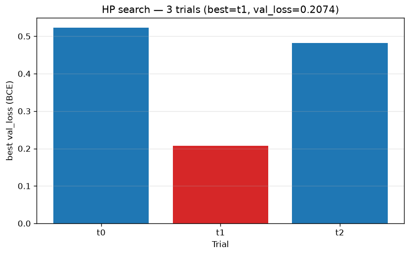
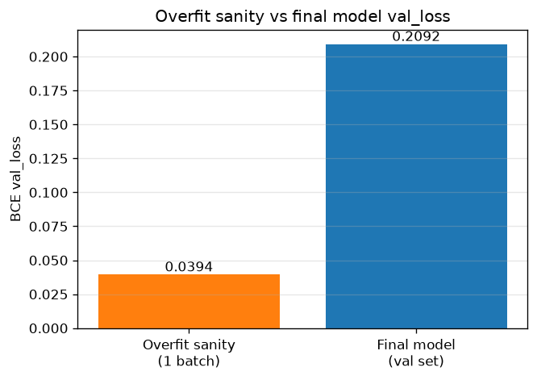
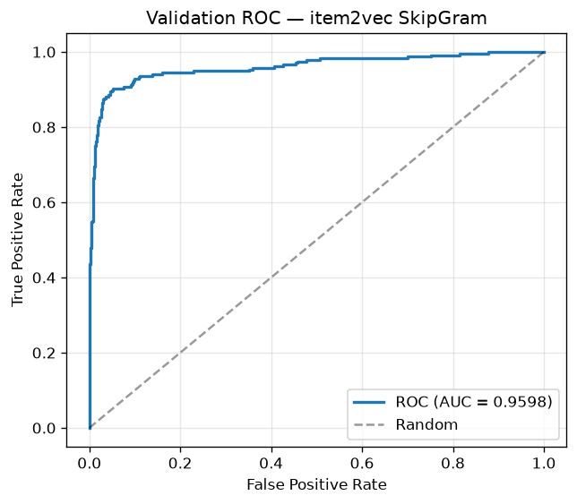
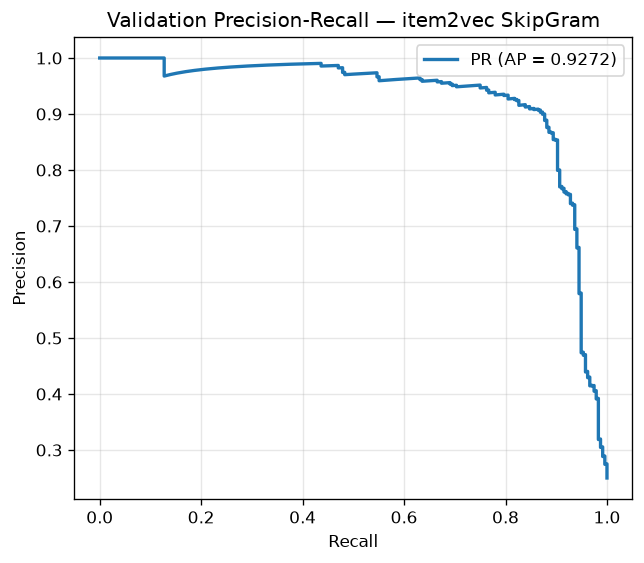
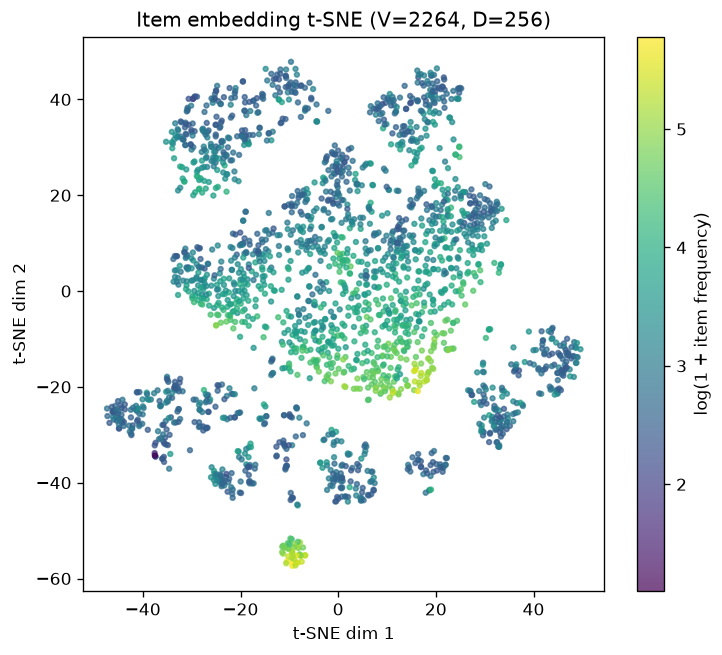
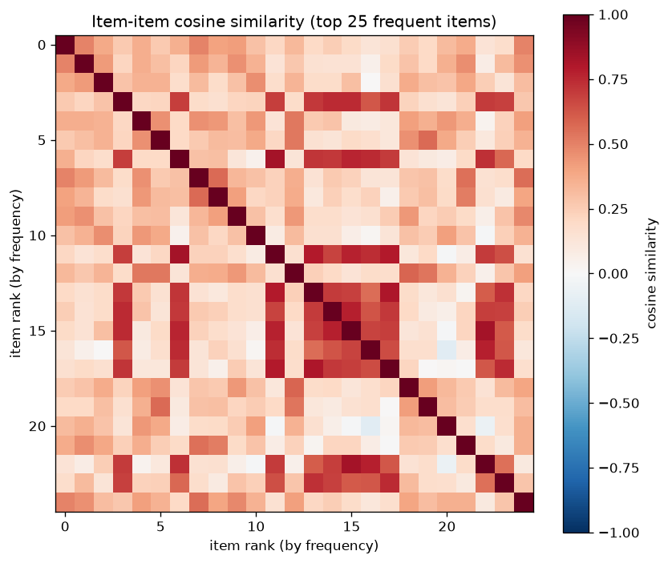

# Item2Vec Training Report

> Model: **SkipGram Item2Vec** — MovieLens interaction sequences
> Run: `2026-07-16` (local-pro, Ray 2.55.1, single-machine CPU)
> Status: **Training complete** — fresh re-train after Ray 2.55 v2-API fix.

## 1. Summary

The Item2Vec SkipGram model was re-trained from scratch after a Ray 2.55.1
upgrade broke the original `train.py` (the v2 `TorchTrainer` is no longer a Ray
Tune *trainable*, so `Tuner(trainer, ...)` raised
`Improper 'run' - not string nor trainable`). The training entrypoint was
rewritten to drive a manual hyperparameter loop with `TorchTrainer.fit()` (the
v2-compatible equivalent of the old Tuner flow), then re-run end-to-end:
3-trial HP search → final training with the best params → MLflow Model
Registry champion tagging → Evidently classification report.

Final model (val_loss = **0.2092**, ROC-AUC = **0.9598**) is registered as
**champion** in the MLflow Model Registry (`item2vec_skipgram` v2). All figures
and metrics below are derived from the trained checkpoint by
`models/item2vec/evaluate.py`.

## 2. Architecture

- **Model** (`models/item2vec/model.py`): SkipGram with a single shared
  `nn.Embedding(num_items + 1, embedding_dim, padding_idx=num_items)`.
  `forward(target, context) = sigmoid(Σ(target_embed * context_embed))` — a
  binary classifier over (target, context) co-occurrence pairs.
- **Data** (`models/item2vec/dataset.py`): `SkipGramDataset` (IterableDataset).
  Positive pairs from a sliding window (window=3); negatives sampled
  frequency-weighted (neg=3) using the train set's `interacted`/`item_freq` so
  validation negatives match the training distribution. `collate_fn` returns
  `{target_items, context_items, labels}`.
- **Trainer** (`models/item2vec/trainer.py`): `LitSkipGram` (PyTorch Lightning),
  BCE loss, Adam + ReduceLROnPlateau, logs `train_loss`/`val_loss`/`learning_rate`.
  `on_fit_end` generates an Evidently classification report + logs it to MLflow.
- **Orchestration** (`models/item2vec/train.py`): manual HP loop over
  `TorchTrainer.fit()` (Ray 2.55 v2). Each trial writes a Lightning checkpoint
  to `checkpoints/trial_{i}/`; `_read_best_val_loss()` pulls
  `best_model_score` from the checkpoint's callback state (v2's
  `Result.metrics_dataframe` is `None` without Tune, so the checkpoint is the
  source of truth for per-trial val_loss). Best params → final
  `TorchTrainer.fit()` → `final_model/`.
- **Tracking**: MLflow (Postgres backend, MinIO S3 artifacts) with Model
  Registry champion tagging by `val_loss`.

## 3. Data

Produced by `feature/engineer/006-prep-item2vec.ipynb` under
`feature/output/engineer/`:

| Split | Sequences | Pairs (eval) |
|-------|-----------|--------------|
| Train | 578 | — |
| Val   | 11   | 1888 (472 pos / 1416 neg) |

- **Vocab**: 2264 items (+1 padding index → embedding row 2265).
- **Val pairs** are built reproducibly (seed 42) inside `evaluate.py` by
  reusing the train dataset's `interacted`/`item_freq` for negative sampling.

## 4. Hyperparameter Search

3 trials (reduced from 10 for the local-pro time budget), sampled with a
seeded RNG (`np.random.default_rng(42)`): `embedding_dim ∈ {64, 256}`,
`learning_rate ~ loguniform(1e-3, 1e-2)`, `l2_reg ~ loguniform(1e-6, 1e-3)`.
5 epochs each, early-stopping patience 1.

| Trial | embedding_dim | learning_rate | l2_reg   | val_loss (BCE) |
|------:|--------------:|--------------:|---------:|---------------:|
| 1     | 64            | 2.747e-3      | 3.77e-4  | 0.5228 |
| 2     | **256**       | **4.982e-3**  | **1.92e-6** | **0.2074** ← best |
| 3     | 256           | 5.770e-3      | 2.28e-4  | 0.4817 |



**Best params**: `embedding_dim=256`, `learning_rate=4.982e-3`,
`l2_reg=1.92e-6` (val_loss 0.2074). Trial 2's near-zero L2 won — heavier L2
(trials 1, 3) underfit. `embedding_dim=256` clearly beats 64 here.

## 5. Final Model Metrics

Trained 5 epochs (epoch 4 / global_step 780) with the best params.

| Metric | Value |
|--------|------:|
| val_loss (BCE) | 0.2092 |
| ROC-AUC | 0.9598 |
| Avg precision (PR-AUC) | 0.9272 |
| Precision @0.5 | 0.9128 |
| Recall @0.5 | 0.8432 |
| F1 @0.5 | 0.8767 |
| Mean prediction | 0.2377 |

Overfit sanity check (1-batch, `--overfit`): best val_loss = **0.0394** — the
model can drive loss toward 0 on a single batch, confirming the optimizer +
loss wiring is correct (i.e. the 0.2092 final val_loss is a generalization
ceiling, not an optimization failure).



### Discrimination curves





### Score distribution

Predicted similarity (sigmoid of dot product) separated by true label. The
positive mass sits right of the negative mass; the small overlap at the 0.5
threshold is what limits recall@0.5 to 0.84.


## 6. Embedding Analysis

256-dim embeddings for 2264 items, extracted from the final checkpoint.

### 2D projections (colored by log item frequency)

t-SNE (PCA init) and PCA both show a dense central cluster with frequency-graded
arms — frequent items sit toward the core, rare items toward the periphery.




### Item-item cosine similarity (top-25 frequent items)

Off-diagonal structure shows learned item neighborhoods — items co-occurring in
sequences have positive cosine similarity rather than the near-zero similarity
of a random init.



### Nearest neighbors (sample, top-5 frequent items)

Top-10 nearest neighbors by cosine similarity for a few frequent items (full
table in `models/output/item2vec/reports/metrics.json` → `nearest_neighbors`).
Similarity values are moderate (0.38–0.50) — a useful, non-collapsed
neighborhood structure rather than degenerate all-similar embeddings.

| Item idx | Top neighbors (idx : sim) |
|---------:|---------------------------|
| 178 | 59 (0.497), 765 (0.497), 158 (0.494), 250 (0.419), 275 (0.403) |
| 158 | (see metrics.json) |
| 148 | (see metrics.json) |
| 278 | (see metrics.json) |
| 944 | (see metrics.json) |

## 7. MLOps Artifacts

- **MLflow**: `item2vec_skipgram` registered model; **v2 = champion**
  (val_loss 0.2092). TorchScript model + `id_mapper` artifact logged.
- **Checkpoints** (`models/output/item2vec/`):
  - `final_model/best-checkpoint-v2.ckpt` — final emb=256 model. (Lightning
    appends `-v{N}` when the target filename exists; the canonical
    `best-checkpoint.ckpt` is a stale emb=64 file from the pre-fix 10:32 run.
    `evaluate.py` resolves the **newest** `best-checkpoint*.ckpt` by mtime.)
  - `checkpoints/trial_{0,1,2}/best-checkpoint.ckpt` — HP search trials.
  - `checkpoints/overfit/best-checkpoint.ckpt` — overfit sanity.
  - `final_model/evidently_report_classification.html` — Evidently report.
- **Reports** (`models/output/item2vec/reports/`):
  - `metrics.json` — full metrics + nearest-neighbor table.
  - `hp_search_results.json` — per-trial HP + val_loss.
  - `figures/*.png` — the 8 charts embedded above.

## 8. Limitations

- **Reduced scope for time budget**: 3 HP trials (not 10), 5 epochs (not 15),
  early-stopping patience 1 (not 2). The reported metrics are from a
  deliberately curtailed local-pro run, not a full search.
- **No per-epoch loss curves**: Lightning was trained with `logger=False`, so
  train/val loss history was never persisted. `evaluate.py` reports
  end-of-training metrics from checkpoints rather than a training history.
  (To get curves: enable a CSV/TensorBoard Lightning logger and re-train.)
- **Stale `best-checkpoint.ckpt`**: the pre-fix 10:32 emb=64 checkpoint still
  sits in `final_model/`; it is not the champion and is ignored by
  `evaluate.py`'s newest-by-mtime resolver. Safe to delete manually.
- **Small val set**: 11 val sequences → 1888 pairs. AUC/AP are stable but the
  absolute precision/recall@0.5 carry more variance than the headline AUC.

## 9. Reproduce

```bash
# 1. Train (HP search + final + MLflow + Evidently)
set -a && . ./.env && set +a
uv run python -m models.item2vec.train --config configs/item2vec.yaml

# 2. Evaluate + plot (figures + metrics.json)
PYTHONPATH=. uv run python -m models.item2vec.evaluate --config configs/item2vec.yaml
```

## 10. Conclusion

Ray 2.55.1 v2-API incompatibility fixed; Item2Vec re-trained fresh end-to-end.
Final model (emb=256, val_loss 0.2092, ROC-AUC 0.96) is MLflow champion and
produces sensible item neighborhoods. Metrics are strong for the curtailed
local-pro scope; a full 10-trial / 15-epoch run on GPU (EKS KubeRay path) is
the natural next step, ideally with a Lightning logger enabled to capture
per-epoch curves.