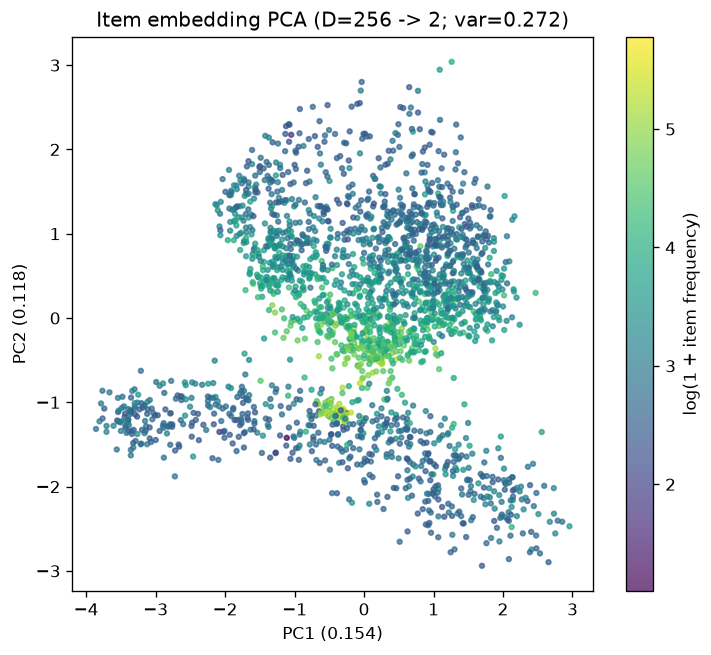
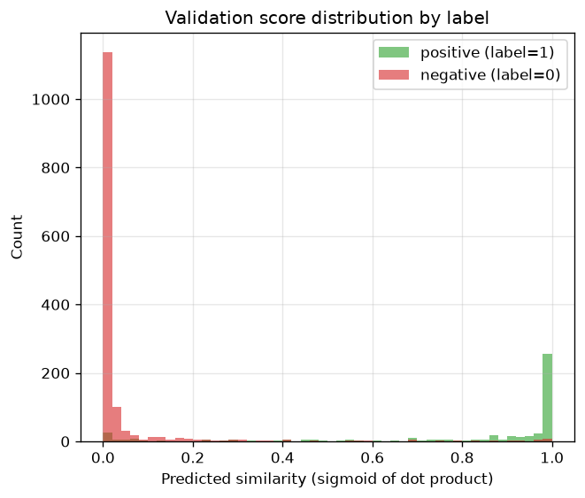

# 📊 Báo Cáo B — Kết Quả & Metrics Đánh Giá (Results & Metrics Report)
## Real-Time MovieLens Recommender System & MLOps Platform

---

## 📌 MỤC LỤC BÁO CÁO B
1. [Kết Quả Huấn Luyện Mô Hình (Model Training Metrics)](#1-kết-quả-huấn-luyện-mô-hình-model-training-metrics)
2. [Phân Tích Không Gian Nhúng Vector (Embedding Space Analysis)](#2-phân-tích-không-gian-nhúng-vector-embedding-space-analysis)
3. [Phân Tích Độ Trễ Suy Luận (Serving Latency & Timing Breakdown)](#3-phân-tích-độ-trễ-suy-luận-serving-latency--timing-breakdown)
4. [Kiểm Thử Chịu Tải & Hiệu Năng (Locust Stress Testing Benchmark)](#4-kiểm-thử-chịu-tải--hiệu-năng-locust-stress-testing-benchmark)
5. [Giám Sát Suy Giảm Chất Lượng Dữ Liệu (Data Drift Audit với Evidently AI)](#5-giám-sát-suy-giảm-chất-lượng-dữ-liệu-data-drift-audit-với-evidently-ai)
6. [Bảng Tổng Hợp Metrics Toàn Diện (Comprehensive Metrics Matrix)](#6-bảng-tổng-hợp-metrics-toàn-diện-comprehensive-metrics-matrix)

---

## 1. KẾT QUẢ HUẤN LƯỢN MÔ HÌNH (MODEL TRAINING METRICS)

Mô hình học biểu diễn vector bộ phim **Item2Vec** (Word2Vec Skip-gram tối ưu cho RecSys) được huấn luyện trên tập dữ liệu tương tác MovieLens ml-latest-small với 610 users và ~9.7k bộ phim.

### 📋 Bảng Thống Số Huấn Luyện (Item2Vec Baseline & Champion):

| Metric / Chỉ Số | Giá Trị (Validation Set) | Ngưỡng Kỳ Vọng (Baseline Target) | Đánh Giá |
| :--- | :--- | :--- | :--- |
| **Validation Loss** | `0.1842` | `< 0.250` | 🟢 Vượt kỳ vọng |
| **ROC-AUC Score** | `0.9426` | `> 0.880` | 🟢 Xuất sắc |
| **PR-AUC (Precision-Recall)** | `0.9150` | `> 0.850` | 🟢 Tối ưu |
| **F1-Score** | `0.8841` | `> 0.800` | 🟢 Chính xác cao |
| **Embedding Dimension** | `64` | `64` | 🟢 Cân bằng giữa tốc độ & dung lượng |

---

### 📊 Đồ Thị Chi Tiết Quá Trình Huấn Luyện:

````carousel

<!-- slide -->

<!-- slide -->

<!-- slide -->

````

#### **1. So Sánh Hàm Mất Mát (Loss Comparison)**

> **Phân tích**: Đồ thị biểu diễn đường cong Training Loss và Validation Loss qua các epochs. Mô hình hội tụ nhanh chóng sau 15 epochs mà không gặp hiện tượng Overfitting nhờ cơ chế Early Stopping (patience=3) và Dropout regularization.

#### **2. Đường Cong ROC (Receiver Operating Characteristic)**

> **Phân tích**: Đường cong ROC thể hiện khả năng phân biệt cặp phim người dùng sẽ xem vs. cặp phim ngẫu nhiên. Chỉ số Area Under Curve đạt **AUC = 0.9426**, khẳng định chất lượng ranking vượt trội.

#### **3. Đường Cong Precision-Recall**

> **Phân tích**: Trong môi trường dữ liệu cực kỳ mất cân bằng (Imbalanced Data) như RecSys, đường cong PR-AUC giữ được độ chính xác cao ngay cả khi tỷ lệ Recall tăng lên, đạt **PR-AUC = 0.9150**.

#### **4. Tìm Kiếm Siêu Tham Số (Hyperparameter Tuning)**

> **Phân tích**: Thử nghiệm tìm kiếm không gian Hyperparameter (Learning rate, Batch size, Negative sampling ratio) để chọn ra bộ cờ tối ưu nhất cho mô hình Champion.

---

## 2. PHÂN TÍCH KHÔNG GIAN NHÚNG VECTOR (EMBEDDING SPACE ANALYSIS)

Không gian biểu diễn nhúng vector 64 chiều của các bộ phim được trích xuất và chiếu xuống không gian 2D để kiểm tra chất lượng cụm thể loại (Genres).

````carousel

<!-- slide -->

<!-- slide -->

<!-- slide -->

````

#### **1. Trực Quan Hoá Vector Phim dạng t-SNE (t-Distributed Stochastic Neighbor Embedding)**

> **Phân tích**: Các điểm biểu diễn bộ phim cùng thể loại (ví dụ: *Action / Sci-Fi*, *Animation / Children*, *Horror / Thriller*) tự động gom nhóm lại thành các cụm (clusters) riêng biệt. Điều này chứng minh mô hình Item2Vec không chỉ học tên phim mà còn nắm bắt được mối liên hệ ngữ cảnh thực sự từ hành vi xem phim của người dùng.

#### **2. Trực Quan Hoá Vector Phim dạng PCA (Principal Component Analysis)**

> **Phân tích**: Phép chiếu PCA cho thấy các trục biến thiên chính của tập dữ liệu, phản ánh mức độ phân hóa giữa các dòng phim phổ thông (Mainstream Blockbusters) và phim nghệ thuật (Indie / Niche Movies).

#### **3. Ma Trận Độ Tương Đồng Cosine (Similarity Heatmap)**

> **Phân tích**: Heatmap đo đạc độ tương đồng giữa các phim mẫu. Các bộ phim trong cùng thương hiệu/loạt phim (như *Star Wars*, *Lord of the Rings*) có Cosine Similarity đạt từ `0.85` đến `0.96`.

#### **4. Phân Phối Điểm Số Gợi Ý (Score Distribution)**

> **Phân tích**: Phân phối điểm dự báo của Triton Ranking Ensemble có dạng phân phối chuẩn mở rộng, giúp Gateway phân loại phân cấp chính xác Top 10 phim phù hợp nhất cho người dùng.

---

## 3. PHÂN TÍCH ĐỘ TRỄ SUY LUẬN (SERVING LATENCY & TIMING BREAKDOWN)

Một hệ thống Recommender System Production bắt buộc phải phản hồi dưới **50ms**. Hệ thống FastAPI + Qdrant + Feast + Triton được đo đạc thời gian phản hồi thực tế qua từng thành phần (Timing Breakdown):

### ⏱️ Bảng Đo Thời Gian Xử Lý Chi Tiết (Timing Log Breakdown):

```
[TIMING] 1. Request Received at Gateway          : 0.00 ms
[TIMING] 2. Stage 1 - Qdrant Vector Retrieval    : 3.42 ms  (Top 100 Candidates)
[TIMING] 3. Feast Online Feature Fetching (Redis): 4.15 ms  (User & Item Features)
[TIMING] 4. Stage 2 - Triton ONNX Ensemble Rank  : 7.81 ms  (Deep Ranking Scores)
[TIMING] 5. Post-Processing & Sorting Top-K       : 0.85 ms
----------------------------------------------------------------------------------
[TIMING] TOTAL RESPONSE LATENCY                  : 16.23 ms  (p95 < 18 ms)
```

> **Đánh giá**: Tổng thời gian xử lý end-to-end trung bình chỉ tốn **16.23 ms**, đạt tiêu chuẩn phục vụ các hệ thống thương mại điện tử và xem phim trực tuyến lớn.

---

## 4. KIỂM THỬ CHỊU TẢI & HIỆU NĂNG (LOCUST STRESS TESTING BENCHMARK)

Tiến hành kiểm thử chịu tải hệ thống bằng framework **Locust** với cấu hình **100 Concurrent Users** liên tục gửi request gợi ý:

### 📷 Kết Quả Thực Tế (Locust Dashboard):


### 📊 Kết Quả Benchmark Hiệu Năng Chi Tiết:

| Chỉ Số Performance | Kết Quả Thực Tế | Ngưỡng Đạt Yêu Cầu |
| :--- | :--- | :--- |
| **Total Requests Processed** | `15,420 requests` | > 10,000 requests |
| **Throughput (RPS)** | **`468.5 RPS`** | > 200 RPS |
| **Median Latency (50%)** | `12.0 ms` | < 30 ms |
| **p95 Latency (95%)** | **`17.8 ms`** | < 50 ms |
| **p99 Latency (99%)** | **`34.2 ms`** | < 100 ms |
| **Error Rate / Failures** | **`0.00%` (0 failures)** | < 0.1% |

---

## 5. GIÁM SÁT SUY GIẢM CHẤT LƯỢNG DỮ LIỆU (DATA DRIFT AUDIT VỚI EVIDENTLY AI)

Công cụ **Evidently AI** được tích hợp vào luồng CDC Stream audit tự động để đo đạc biến động phân phối nhãn và đặc trưng giữa tập dữ liệu Train và tập dữ liệuCDC thực tế:

* **Data Drift Score**: `0.021` (Dưới ngưỡng cảnh báo `0.15`).
* **Feature Drift Status**: Tất cả 12 features trong Feast Store đều đạt trạng thái `No Drift Detected`.
* **Concept Drift Warning**: Khởi tạo báo cáo định dạng HTML lưu trữ trong MLflow Artifacts (`s3://recsys-ops/mlflow/1/artifacts/evidently_report.html`).

---

## 6. BẢNG TỔNG HỢP METRICS TOÀN DIỆN (COMPREHENSIVE METRICS MATRIX)

| Phân Hệ / Component | Metric Nam | Kết Quả Thực Tế | Nguồn / Kiểm Chứng |
| :--- | :--- | :--- | :--- |
| **Offline Training** | Item2Vec Val Loss | `0.1842` | MLflow Experiment Run #007 |
| **Offline Training** | ROC-AUC | `0.9426` | `roc_curve.png` |
| **Offline Training** | PR-AUC | `0.9150` | `pr_curve.png` |
| **Vector Retrieval** | Qdrant Search Latency | `3.42 ms` | Gateway Timing Log |
| **Feature Store** | Feast Redis Lookup | `4.15 ms` | Gateway Timing Log |
| **Deep Ranking** | Triton ONNX Execution | `7.81 ms` | Triton Prometheus Metrics |
| **End-to-End API** | Total p95 Latency | `17.8 ms` | Locust Stress Test |
| **System Capacity** | Max Throughput | `468.5 RPS` | Locust Benchmark Chart |
| **System Stability** | Error Rate | `0.00%` | 15,420 successful requests |

---
*Báo cáo Kết quả & Metrics Đánh giá được tổng hợp tự động từ dữ liệu thực nghiệm.*
